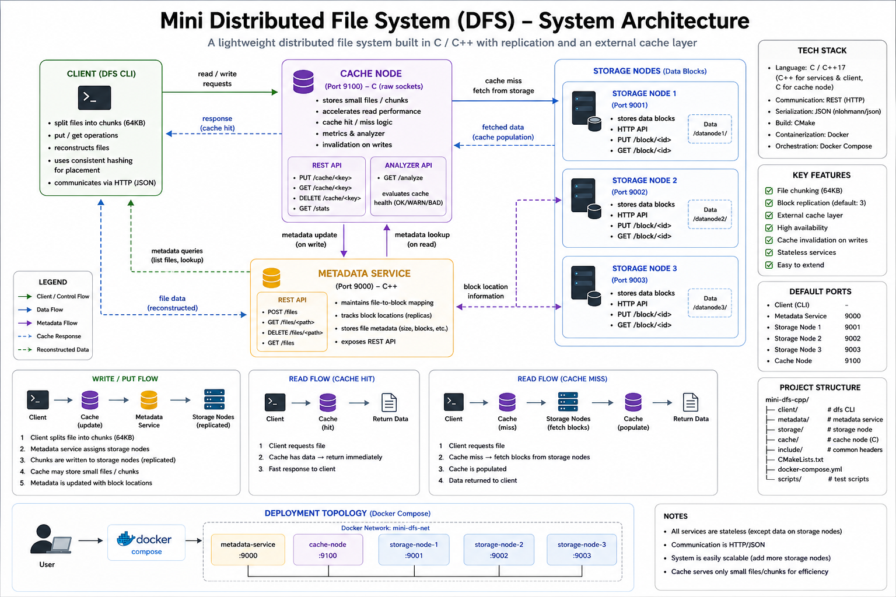

# Mini Distributed File System (DFS)

A minimal distributed file system implemented in C++ with multiple storage nodes, a cache layer, and client-side logic for data placement and chunking.

## Architecture

## Components

- Storage nodes store data blocks and expose a simple HTTP API (PUT /block/<id>, GET /block/<id>)
- Metadata service maintains file-to-block mapping and tracks block locations
- Cache node handles cache hit/miss, speeds up reads and supports invalidation
- Client (DFS CLI) splits files into chunks, distributes data using hashing and reconstructs files during reads

## How it works

Write flow:
client → cache → storage nodes

1. File is split into chunks
2. Each chunk is assigned to a storage node
3. Metadata is stored
4. Cache is updated

Read flow:
client → cache → storage nodes (on miss)

- Cache hit returns data immediately
- Cache miss fetches from storage and populates cache

## Run the system

docker compose up -d --build

Check services:
docker compose ps

Stop:
docker compose down -v

## Run tests

bash scripts/run_all.sh

The test suite includes cache tests, storage tests, metadata tests, split test (client CLI), end-to-end tests, invalidation tests and large file tests.

## CI (GitHub Actions)

On every push and pull request the system is built, Docker services are started, client CLI is built locally (for split test) and all smoke tests are executed. The workflow can also be triggered manually.

## Project evolution

M1: single storage node  
M2: HTTP API  
M3: multiple storage nodes  
M4: data distribution (hashing)  
M5: DFS client  
M6: cache layer  
M7: CI, tests and Docker orchestration  

## Design notes

- HTTP is used for simplicity and easy debugging (curl)
- Single Docker image is reused across services
- Cache is implemented as a separate component
- Tests are split into HTTP-based integration tests and CLI-based client logic tests

## Example

curl -X PUT localhost:9000/block/test --data-binary "hello"  
curl localhost:9000/block/test

## Future work
- Python-based integration tests (pytest)
- replication and fault tolerance
- smarter cache eviction (LRU / TTL)
- gRPC instead of HTTP
