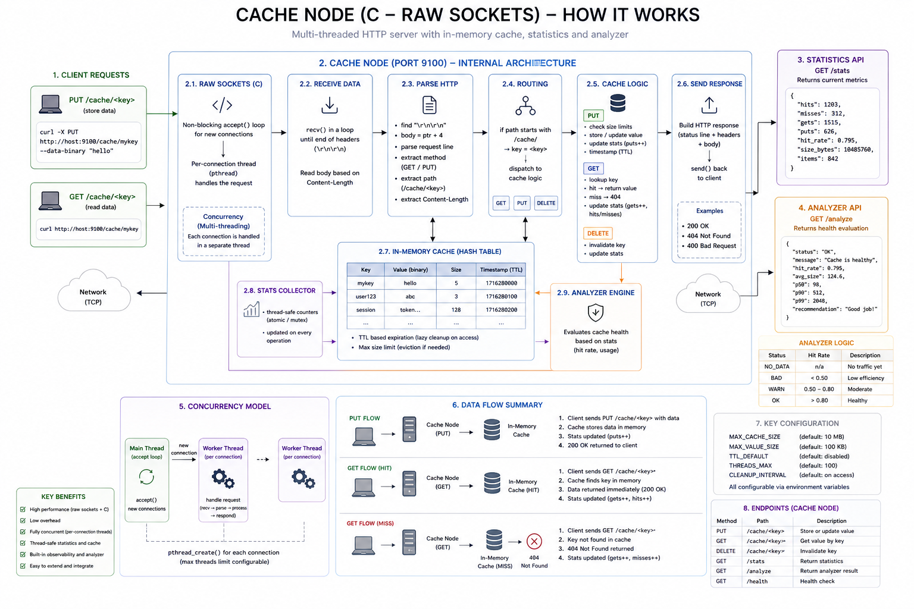

# Mini Distributed File System (DFS)

A minimal distributed file system implemented in C++ with a C-based cache layer, designed to demonstrate core distributed systems concepts such as data distribution, replication, and caching.

The system is containerized using Docker and orchestrated with Docker Compose. It consists of multiple services running as separate containers: three storage nodes (implemented in C++) responsible for storing data blocks, a metadata service maintaining file-to-block mappings, and a high-performance cache service implemented in C to accelerate read operations.

A client component handles file operations by splitting files into chunks, distributing them across storage nodes, and reconstructing them during reads. Small files can be cached and served directly from the cache layer, while larger files bypass the cache based on configurable size thresholds and are fetched directly from storage nodes.

This hybrid C/C++ architecture highlights the use of C++ for higher-level orchestration and system logic, while leveraging C for a lightweight, efficient cache layer with low overhead and fine-grained control over memory and performance.

The architecture diagram below illustrates how these components interact, including data flow between the client, cache, metadata service, and storage nodes.

## Architecture


## Components

- Storage nodes store data blocks and expose a simple HTTP API (PUT /block/<id>, GET /block/<id>)
- Metadata service maintains file-to-block mapping and tracks block locations
- Cache node handles cache hit/miss, speeds up reads and supports invalidation
- Client (DFS CLI) splits files into chunks, distributes data using hashing and reconstructs files during reads
- Analyzer evaluates cache health based on runtime metrics and exposes a /analyze endpoint

## Key Features

- Distributed storage across multiple nodes
- Client-side data chunking and reconstruction
- Cache layer with size-based filtering
- Cache observability via metrics and analyzer
- Deterministic test suite with full system coverage
- Containerized architecture (Docker + Compose)

## Cache Observability

The cache node exposes runtime metrics and a lightweight analyzer:

```
- `GET /stats` – returns raw cache metrics (hits, misses, gets, puts)
- `GET /analyze` – evaluates cache efficiency and returns health status
```
Example:

```
curl localhost:9100/analyze
```

Response:

```
{ "status": "OK", "message": "Cache is healthy", "hit_rate": 1.000 }
```

The analyzer classifies cache performance:

```
- `NO_DATA` – no traffic observed
- `BAD` – low cache efficiency (hit rate < 0.5)
- `WARN` – moderate efficiency
- `OK` – high cache efficiency
```



### Write flow

client → cache → metadata → storage nodes

1. File is split into chunks
2. Metadata service assigns storage nodes
3. Chunks are written to storage nodes
4. Cache may store small files

### Read flow

client → cache → storage nodes (on miss)

- Cache hit returns data immediately
- Cache miss fetches from storage and populates cache

## Run the system
```
docker compose up -d --build
```

Check services:
```
docker compose ps
```

Stop:
```
docker compose down -v
```

## Automated tests (scripts-based)
```
bash scripts/run_all.sh
```

The test suite includes cache tests, storage tests, metadata tests, split test (client CLI), end-to-end tests, invalidation tests and large file tests.

## Manual tests (curl examples)

#### STORAGE (9001)
```
curl -X PUT localhost:9001/block/test --data-binary "hello"
curl localhost:9001/block/test
```

#### METADATA (9000)
```
curl -X POST localhost:9000/files \
  -H "Content-Type: application/json" \
  -d '{"path":"/file.txt","blocks":[{"id":"block1","nodes":["localhost:9001"],"size":5}]}'

curl localhost:9000/files/file.txt
```

#### CACHE (9100)

```
curl -X PUT localhost:9100/cache/a --data-binary "hello"
curl localhost:9100/cache/a
curl localhost:9100/stats
curl localhost:9100/analyze
```

#### CLIENT (CLI)
```
./build/dfs split input.txt
./build/dfs put input.txt /file.txt
./build/dfs get /file.txt output.txt
```

## Resilience and Benchmark Testing

The project includes system-level tests focused on two areas:

- simulating a storage node failure
- running lightweight `wrk` benchmarks against storage and cache nodes

### Storage node failure simulation

The DFS client supports replica fallback during reads. If one storage node is unavailable, the client tries the next replica listed in metadata.

Example:

```bash
docker compose stop storage1

./build/dfs get test.txt out_after_kill.txt
cmp test.txt out_after_kill.txt
```

For writes, the client retries additional storage nodes until the configured replication factor is satisfied.

```
dd if=/dev/urandom of=big.bin bs=1024 count=200
./build/dfs put big.bin big.bin
./build/dfs get big.bin big_out.bin
cmp big.bin big_out.bin
wrk benchmarks
```

### Basic storage node benchmark:

```
BLOCK_ID=$(curl -s http://localhost:9000/files/big.bin | python3 -c "import sys,json; print(json.load(sys.stdin)['blocks'][0]['id'])")
wrk -t2 -c10 -d10s http://localhost:9002/block/$BLOCK_ID
```

### Basic cache node benchmark:

```
echo "cache test payload" > cache.txt
./build/dfs put cache.txt cache.txt

wrk -t2 -c10 -d10s http://localhost:9100/cache/cache.txt
```

## CI (GitHub Actions)

On every push and pull request the system is built, Docker services are started, client CLI is built locally (for split test) and all smoke tests are executed. The workflow can also be triggered manually.

## Project evolution

- M1: Single Storage Node
- M2: HTTP API
- M3: Multiple Storage Nodes
- M4: Data Distribution (Hashing)
- M5: DFS Client
- M6: Cache Layer
- M7: CI, Tests and Docker Orchestration
- M8: Cache Robustness and Observability
- M9: Cache Analyzer and Health Evaluation
- M10: Multithreaded Cache Node and Concurrency  

